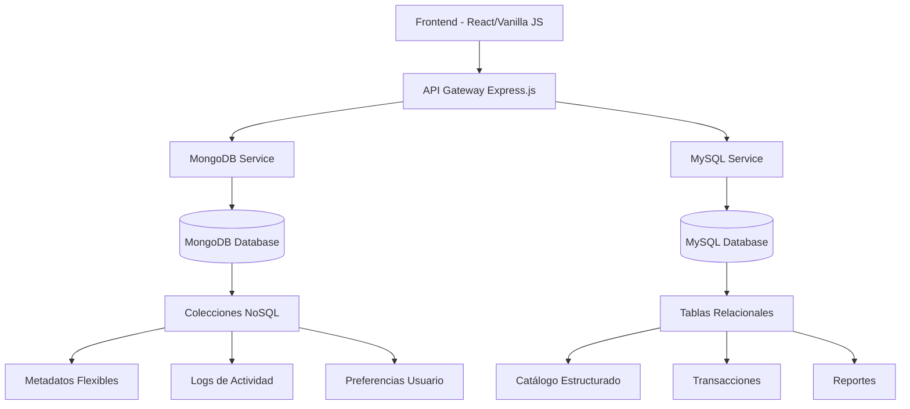

# 🏆 Proyecto Final: Sistema de Gestión Musical Híbrido

<div style="background: linear-gradient(135deg, #4DB33D 0%, #005A9C 50%, #FFB81C 100%); padding: 20px; border-radius: 10px; color: white; margin: 20px 0;">
  <h2 style="margin: 0;">🎵 MusicDB Pro - Sistema Híbrido</h2>
  <p style="margin: 10px 0 0 0;">La combinación perfecta de MongoDB y MySQL</p>
</div>

## 🎯 Descripción del Proyecto

**MusicDB Pro** es un sistema completo de gestión musical que aprovecha las fortalezas tanto de MongoDB como de MySQL para ofrecer una experiencia robusta y escalable.

## 🏗️ Arquitectura del Sistema



## 📊 Distribución de Datos

### 🍃 MongoDB (Flexibilidad y Performance)

**Casos de uso ideales:**
- ✅ Metadatos variables de canciones
- ✅ Logs de reproducción en tiempo real
- ✅ Preferencias de usuario complejas
- ✅ Búsquedas de texto completo
- ✅ Datos de sesión y caché

**Colecciones:**
```javascript
// playback_logs - Logs de reproducción
{
  "_id": ObjectId("..."),
  "usuario_id": 123,
  "cancion_id": 456,
  "timestamp": ISODate("..."),
  "dispositivo": "web",
  "ubicacion": { "lat": 40.7128, "lng": -74.0060 },
  "duracion_escuchada": 180,
  "calidad": "HD"
}

// search_analytics - Analytics de búsqueda
{
  "_id": ObjectId("..."),
  "query": "queen bohemian",
  "resultados": 15,
  "clicks": [1, 3, 7],
  "timestamp": ISODate("..."),
  "usuario_sesion": "session_123"
}

// user_preferences - Preferencias personalizadas
{
  "_id": ObjectId("..."),
  "usuario_id": 123,
  "generos_favoritos": ["Rock", "Pop", "Jazz"],
  "artistas_seguidos": [1, 15, 23, 45],
  "configuracion": {
    "calidad_audio": "alta",
    "modo_offline": true,
    "notificaciones": {
      "nuevos_albums": true,
      "conciertos": false
    }
  },
  "historial_reciente": [...]
}
```

### 🗄️ MySQL (Estructura y Consistencia)

**Casos de uso ideales:**
- ✅ Catálogo maestro de artistas/álbumes
- ✅ Transacciones financieras
- ✅ Datos de usuarios críticos
- ✅ Reportes consolidados
- ✅ Relaciones complejas

**Tablas principales:**
```sql
-- Estructura relacional normalizada
CREATE TABLE artistas (
    id INT PRIMARY KEY AUTO_INCREMENT,
    nombre VARCHAR(100) NOT NULL UNIQUE,
    pais VARCHAR(50),
    fecha_fundacion DATE,
    biografia TEXT,
    activo BOOLEAN DEFAULT TRUE,
    created_at TIMESTAMP DEFAULT CURRENT_TIMESTAMP
);

CREATE TABLE albumes (
    id INT PRIMARY KEY AUTO_INCREMENT,
    titulo VARCHAR(150) NOT NULL,
    artista_id INT NOT NULL,
    fecha_lanzamiento DATE,
    tipo ENUM('album', 'ep', 'single') DEFAULT 'album',
    precio DECIMAL(10,2),
    FOREIGN KEY (artista_id) REFERENCES artistas(id)
);

CREATE TABLE canciones (
    id INT PRIMARY KEY AUTO_INCREMENT,
    titulo VARCHAR(150) NOT NULL,
    album_id INT NOT NULL,
    duracion_segundos INT NOT NULL,
    numero_pista INT,
    precio DECIMAL(10,2),
    FOREIGN KEY (album_id) REFERENCES albumes(id)
);

CREATE TABLE usuarios (
    id INT PRIMARY KEY AUTO_INCREMENT,
    email VARCHAR(100) UNIQUE NOT NULL,
    password_hash VARCHAR(255) NOT NULL,
    nombre VARCHAR(100),
    tipo_suscripcion ENUM('free', 'premium', 'family') DEFAULT 'free',
    fecha_registro TIMESTAMP DEFAULT CURRENT_TIMESTAMP,
    activo BOOLEAN DEFAULT TRUE
);

CREATE TABLE compras (
    id INT PRIMARY KEY AUTO_INCREMENT,
    usuario_id INT NOT NULL,
    cancion_id INT,
    album_id INT,
    precio DECIMAL(10,2) NOT NULL,
    fecha_compra TIMESTAMP DEFAULT CURRENT_TIMESTAMP,
    metodo_pago ENUM('tarjeta', 'paypal', 'wallet'),
    FOREIGN KEY (usuario_id) REFERENCES usuarios(id),
    FOREIGN KEY (cancion_id) REFERENCES canciones(id),
    FOREIGN KEY (album_id) REFERENCES albumes(id)
);
```

## 🔧 Tecnologías Utilizadas

### Backend
- **Node.js + Express.js** - API REST
- **Mongoose** - ODM para MongoDB
- **Sequelize** - ORM para MySQL
- **JWT** - Autenticación
- **bcrypt** - Encriptación de contraseñas

### Frontend
- **HTML5/CSS3/JavaScript** - Interfaz de usuario
- **Fetch API** - Comunicación con backend
- **Chart.js** - Visualización de datos
- **Bootstrap** - Framework CSS

### Bases de Datos
- **MongoDB 7.0** - Base de datos NoSQL
- **MySQL 8.0** - Base de datos SQL

## 📁 Estructura del Proyecto

```
proyecto-final/
├── 📂 backend/
│   ├── 📂 config/
│   │   ├── mongodb.js
│   │   └── mysql.js
│   ├── 📂 models/
│   │   ├── mongodb/
│   │   │   ├── PlaybackLog.js
│   │   │   ├── SearchAnalytics.js
│   │   │   └── UserPreferences.js
│   │   └── mysql/
│   │       ├── Usuario.js
│   │       ├── Artista.js
│   │       ├── Album.js
│   │       ├── Cancion.js
│   │       └── Compra.js
│   ├── 📂 routes/
│   │   ├── auth.js
│   │   ├── canciones.js
│   │   ├── artistas.js
│   │   ├── analytics.js
│   │   └── usuarios.js
│   ├── 📂 middleware/
│   │   ├── auth.js
│   │   └── validation.js
│   ├── 📂 services/
│   │   ├── mongoService.js
│   │   ├── mysqlService.js
│   │   └── hybridService.js
│   ├── server.js
│   └── package.json
├── 📂 frontend/
│   ├── 📂 css/
│   │   ├── styles.css
│   │   └── mongodb-theme.css
│   ├── 📂 js/
│   │   ├── app.js
│   │   ├── api.js
│   │   ├── dashboard.js
│   │   └── analytics.js
│   ├── 📂 pages/
│   │   ├── index.html
│   │   ├── dashboard.html
│   │   ├── canciones.html
│   │   └── analytics.html
│   └── 📂 assets/
│       ├── logo-mongodb.png
│       └── logo-mysql.png
├── 📂 documentacion/
│   ├── api-endpoints.md
│   ├── base-datos-diseño.md
│   ├── guia-instalacion.md
│   └── casos-uso.md
├── 📂 scripts/
│   ├── setup-databases.js
│   ├── migrate-data.js
│   └── seed-data.js
├── docker-compose.yml
├── package.json
└── README.md
```

## 🚀 Funcionalidades Principales

### 🎵 Gestión de Música
- [x] **Catálogo completo** de artistas, álbumes y canciones
- [x] **Búsqueda avanzada** con texto completo (MongoDB)
- [x] **Reproducción** con logging en tiempo real
- [x] **Recomendaciones** basadas en historial
- [x] **Favoritos** y listas de reproducción

### 👤 Gestión de Usuarios
- [x] **Registro y autenticación** JWT
- [x] **Perfiles personalizables** con preferencias
- [x] **Diferentes tipos** de suscripción
- [x] **Historial** de reproducciones
- [x] **Dashboard** personalizado

### 💰 Comercio Electrónico
- [x] **Catálogo de ventas** (MySQL para transacciones)
- [x] **Carrito de compras**
- [x] **Procesamiento de pagos**
- [x] **Historial de compras**
- [x] **Reportes de ventas**

### 📊 Analytics y Reportes
- [x] **Dashboards** en tiempo real
- [x] **Métricas de uso** (MongoDB para velocidad)
- [x] **Reportes financieros** (MySQL para precisión)
- [x] **Análisis de búsquedas**
- [x] **Tendencias musicales**

## 🔄 APIs Híbridas

### Endpoint de Búsqueda (Usa ambas bases de datos)
```javascript
// GET /api/search?q=queen&includeAnalytics=true
app.get('/api/search', async (req, res) => {
  const { q, includeAnalytics } = req.query;
  
  // 1. Búsqueda en catálogo (MySQL) - datos estructurados
  const catalogResults = await mysqlService.searchCatalog(q);
  
  // 2. Búsqueda en metadatos (MongoDB) - texto completo
  const metadataResults = await mongoService.fullTextSearch(q);
  
  // 3. Combinar resultados
  const combinedResults = hybridService.mergeResults(
    catalogResults, 
    metadataResults
  );
  
  // 4. Registrar búsqueda para analytics (MongoDB)
  if (includeAnalytics) {
    await mongoService.logSearch(q, combinedResults.length);
  }
  
  res.json(combinedResults);
});
```

### Endpoint de Dashboard del Usuario
```javascript
// GET /api/dashboard/:userId
app.get('/api/dashboard/:userId', async (req, res) => {
  const { userId } = req.params;
  
  // Datos del usuario (MySQL)
  const userData = await mysqlService.getUser(userId);
  
  // Preferencias y configuración (MongoDB)
  const preferences = await mongoService.getUserPreferences(userId);
  
  // Historial reciente (MongoDB)
  const recentActivity = await mongoService.getRecentActivity(userId);
  
  // Compras y suscripción (MySQL)
  const purchaseHistory = await mysqlService.getPurchases(userId);
  
  // Recomendaciones (MongoDB + algoritmo)
  const recommendations = await hybridService.getRecommendations(
    userId, preferences, recentActivity
  );
  
  res.json({
    user: userData,
    preferences,
    recentActivity,
    purchaseHistory,
    recommendations
  });
});
```

## 📈 Ventajas del Enfoque Híbrido

### 🍃 MongoDB Aporta:
- **Flexibilidad** en el esquema de datos
- **Escalabilidad horizontal** natural
- **Performance** en consultas complejas
- **Rapidez** en desarrollo e iteración
- **Análisis** de datos no estructurados

### 🗄️ MySQL Aporta:
- **Integridad** referencial garantizada
- **Transacciones** ACID completas
- **Reportes** complejos con JOINs
- **Herramientas** maduras de BI
- **Cumplimiento** normativo y auditoría

## 🎯 Casos de Uso Específicos

### Escenario 1: Usuario reproduce una canción
1. **MySQL**: Verificar que el usuario tiene acceso a la canción
2. **MongoDB**: Registrar el evento de reproducción con metadatos
3. **MongoDB**: Actualizar preferencias y algoritmo de recomendación

### Escenario 2: Usuario compra un álbum
1. **MySQL**: Procesar transacción financiera
2. **MySQL**: Actualizar inventario y accesos del usuario
3. **MongoDB**: Registrar evento para analytics
4. **MongoDB**: Actualizar preferencias de género musical

### Escenario 3: Generación de reporte mensual
1. **MongoDB**: Extraer métricas de uso y reproducciones
2. **MySQL**: Obtener datos financieros y de suscripciones
3. **Híbrido**: Combinar datos para dashboard ejecutivo

## 🔧 Instalación y Configuración

### Prerrequisitos
```bash
# Node.js 18+
node --version

# MongoDB 7.0+
mongod --version

# MySQL 8.0+
mysql --version
```

### Instalación Rápida
```bash
# Clonar proyecto
git clone [repo-url]
cd proyecto-final

# Instalar dependencias
npm install

# Configurar bases de datos
npm run setup:databases

# Migrar datos de ejemplo
npm run migrate:sample-data

# Iniciar en modo desarrollo
npm run dev
```

### Variables de Entorno
```bash
# .env
MONGODB_URI=mongodb://localhost:27017/musicdb_pro
MYSQL_HOST=localhost
MYSQL_USER=root
MYSQL_PASSWORD=password
MYSQL_DATABASE=musicdb_pro
JWT_SECRET=tu_clave_secreta_aqui
PORT=3000
```

## 🏆 Criterios de Evaluación

### Funcionalidad (40%)
- [ ] CRUD completo en ambas bases de datos
- [ ] Autenticación y autorización
- [ ] API híbrida funcionando
- [ ] Frontend conectado correctamente

### Diseño de Datos (30%)
- [ ] Esquema MongoDB bien estructurado
- [ ] Base de datos MySQL normalizada
- [ ] Distribución lógica de datos
- [ ] Integridad referencial

### Performance (20%)
- [ ] Consultas optimizadas
- [ ] Índices apropiados
- [ ] Manejo eficiente de datos grandes
- [ ] Tiempo de respuesta < 200ms

### Código y Documentación (10%)
- [ ] Código limpio y comentado
- [ ] Documentación completa
- [ ] Manejo de errores
- [ ] Tests básicos

---

<div style="background-color: #4DB33D; padding: 15px; border-radius: 5px; color: white; text-align: center;">
  <strong>🎉 ¡Proyecto Final del Curso!</strong><br>
  Demuestra todo lo aprendido en estos 3 días intensivos
</div>

## 📝 Entregables

1. **Código fuente completo** en repositorio Git
2. **Base de datos** poblada con datos de ejemplo
3. **Documentación** de API y arquitectura
4. **Demo en vivo** de 10 minutos
5. **Presentación** explicando decisiones de diseño

## 🔗 Recursos Adicionales

- [MongoDB Best Practices](https://docs.mongodb.com/manual/administration/production-notes/)
- [MySQL Performance Tuning](https://dev.mysql.com/doc/refman/8.0/en/optimization.html)
- [Node.js + Express Patterns](https://expressjs.com/en/advanced/best-practice-performance.html)
