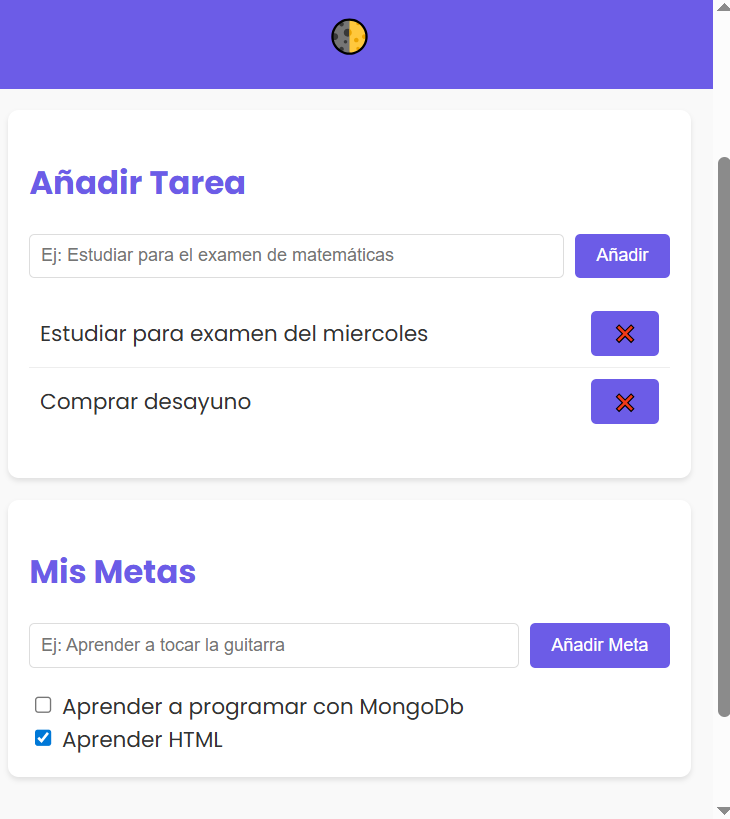

# Mi Planificador de Tareas y Metas

**Una aplicación web interactiva para adolescentes que les ayuda a organizar sus tareas diarias y establecer metas personales.**

 *(Opcional: añade una captura de pantalla de tu aplicación en la carpeta `assets`)*

---

## 📌 Descripción
"Mi Planificador de Tareas y Metas" es una aplicación web diseñada para adolescentes, que les permite:
- **Añadir, editar y eliminar tareas** diarias.
- **Establecer metas** a corto y largo plazo.
- **Visualizar su progreso** mediante gráficos y barras de avance.
- **Personalizar su experiencia** con modo claro/oscuro.
- **Recibir recordatorios** para mantenerse enfocados.

La aplicación está construida con **HTML, CSS y JavaScript puro**, y sigue los principios de **accesibilidad (WCAG)** y **usabilidad** para garantizar una experiencia inclusiva y atractiva.

---

## 🛠 Tecnologías Utilizadas
- **HTML5**: Estructura semántica y accesible.
- **CSS3**: Estilos modernos, diseño responsive y modo oscuro/claro.
- **JavaScript (ES6)**: Lógica interactiva para gestionar tareas y metas.
- **Google Fonts**: Tipografía "Poppins" para un diseño atractivo.

---

## 📂 Estructura del Proyecto
/mi-planificador/
│── index.html          # Estructura principal de la aplicación
│── styles/
│   └── style.css       # Estilos CSS
│── scripts/
│   └── app.js          # Lógica de la aplicación en JavaScript
│── assets/             # Imágenes y recursos visuales (opcional)
│   └── preview.png     # Captura de pantalla de la aplicación
│── README.md           # Este archivo


---

## 🚀 Instalación y Uso
1. **Clona el repositorio** o descarga los archivos:
   ```bash
   git clone https://github.com/tu-usuario/mi-planificador.git
Abre el archivo index.html en tu navegador web favorito (Chrome, Firefox, Edge, etc.).


¡Empieza a organizar tus tareas y metas!

Añade tareas en la sección "Añadir Tarea".
Establece metas en la sección "Mis Metas".
Marca las tareas y metas como completadas.
Cambia entre modo claro y oscuro con el botón 🌓.


🎨 Personalización

Modo oscuro/claro: Haz clic en el botón 🌓 en la esquina superior derecha para cambiar el tema.
Estilos: Modifica el archivo styles/style.css para cambiar colores, fuentes o diseños.
Funcionalidades: Edita el archivo scripts/app.js para añadir nuevas características (ej: notificaciones, categorías de tareas, etc.).


📝 Accesibilidad y Usabilidad
Este proyecto sigue las Pautas de Accesibilidad para el Contenido Web (WCAG):

Contraste adecuado entre texto y fondo.
Atributos aria-label para elementos interactivos.
Diseño responsive para dispositivos móviles y de escritorio.
Navegación intuitiva y feedback visual al interactuar.


🤝 Contribuciones
¡Las contribuciones son bienvenidas! Si tienes ideas para mejorar la aplicación, sigue estos pasos:

Haz un fork del repositorio.
Crea una rama para tu funcionalidad (git checkout -b nueva-funcionalidad).
Realiza tus cambios y haz commit (git commit -m "Añade nueva funcionalidad").
Haz push a la rama (git push origin nueva-funcionalidad).
Abre un Pull Request.


📜 Licencia
Este proyecto está bajo la Licencia MIT. Consulta el archivo LICENSE para más detalles.


## 📫 Contacto
Si tienes preguntas o sugerencias, no dudes en contactarme:
📧 Juan Manuel Mudarra Pozo — [jmmudarra@gmail.com](mailto:jmmudarra@gmail.com)  
💼 [LinkedIn](https://www.linkedin.com/in/nerosjuanma/)  
🌐 [Portfolio](https://nerosjuanma.github.io/JuanManuel-MudarraPozo.github.io/)

GitHub: @nerosjuanma

© 2025 - Juan Manuel Mudarra Pozo


---

### **Instrucciones adicionales para GitHub:**
1. **Añade una captura de pantalla** (`preview.png`) en la carpeta `assets` para que el `README.md` sea más visual.
2. **Crea un archivo `LICENSE`** con la licencia MIT (puedes generarlo automáticamente al crear el repositorio en GitHub).
3. **Sube los archivos** a tu repositorio:
   ```bash
   git add .
   git commit -m "Versión inicial del planificador de tareas y metas"
   git push origin main
